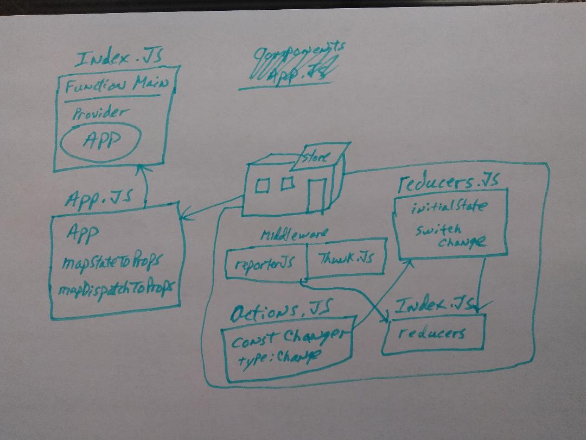
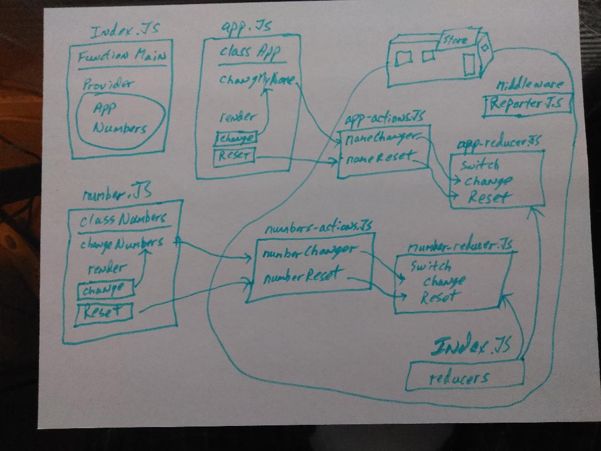

 LAB
=================================================

## Lab 31

### Author: Ed Puzino

### Links and Resources
* [repo](https://github.com/edpuzino/lab-31)
* [travis](https://travis-ci.com/edpuzino/lab-31)
* [code-sand-box](https://codesandbox.io/s/z3p69lmx0l) Assignment 1
* [code-sand-box](https://codesandbox.io/s/w6o1mjv5m5) Assignment 2

## Assignment 1

### Modules
#### `index.js`
##### Function Main

#### `app.js`
##### Class App

#### `actions.js`
##### const changer

#### `reducers.js`
##### switch change

#### `reporter.js`
#### `thunk.js`
#### `index.js`

## Assignment 2

### Modules
#### `index.js`
##### Function Main

#### `app.js`
##### Class App
##### changeMyName

#### `app-actions.js`
##### nameChanger
##### nameReset

#### `app-reducers.js`
##### switch change, reset

#### `number.js`
##### Class Numbers
##### changeNumbers

#### `numbers-actions.js`
##### numberChanger
##### nnumberReset

#### `number-reducers.js`
##### switch change, reset

#### `reporter.js`
#### `index.js`

#### Running the app
* Lab parts 1 and 2 are running on codesandbox, the links are listed above.

#### UML
 Assignment 1
 Assignment 2
